# Petunjuk dan Dokumentasi

> Projek   : Camer (Catat Meter Air dan Listrik)
> Bagian   : Front-End
> Platform  : Android
> Framework : React Native

## Kloning

1. Gandakan repository ini pada komputer anda
2. Ikuti tutorial pemasangan React Native pada [laman](https://reactnative.dev/docs/environment-setup) ini
3. Pastikan anda memiliki `nodejs` pada komputer anda, jika belum anda dapat mendownload nya pada [laman] (<https://nodejs.org/>) ini
4. Masuk ke project yang telah anda kloning, lalu pada terminal ketikkan `npm i -g yarn`
5. Setelah Yarn terinstall, install dependensi project dengan memasukkan perintah pada terminal `yarn install`
6. Buka file `build.gradle` pada folder [node_modules/react-native-month-year-picker/android/build.gradle](node_modules/react-native-month-year-picker/android/build.gradle), dan replace semua kodenya dengan kode pada [file](_debug/build.gradle)

7. Ketikkan `yarn android` pada terminal project ini. Jika setup environment anda benar maka akan terbuka jendela bash baru untuk debugging.

## Exporting APK

1. Arahkan terminal pada folder `android` dengan `cd android`
2. Masukkan perintah `./gradlew assembleRelease`
3. Setelah proses selesai, anda akan dapatkan file apk pada [android/app/build/generated/../outputs/apk/debug/app-debug.apk](android/app/build/generated/../outputs/apk/debug/app-debug.apk)
4. Pasang file apk tersebut pada perangkat android anda

## Manual Book

### User Perspective

1. Buka aplikasi Camer yang sudah terinstall pada perangkat anda.
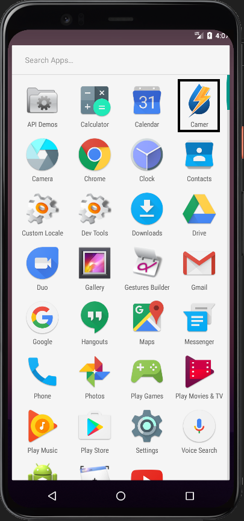
2. Tampilan awal aplikasi camer.
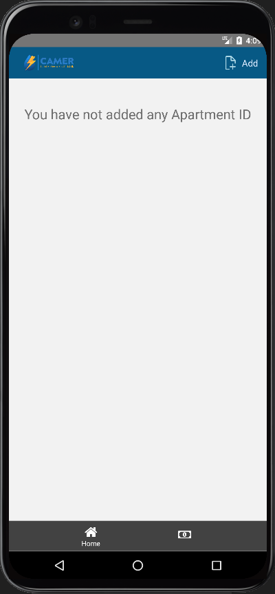
3. Dengan asumsi pengguna sudah mendapatkan id dari pihak pengelola apartemen, pengguna dapat langsung menambahkan id dengan menekan tombol `Add`. Dan akan muncul isian id untuk penambahan apartemen yang akan di monitor.
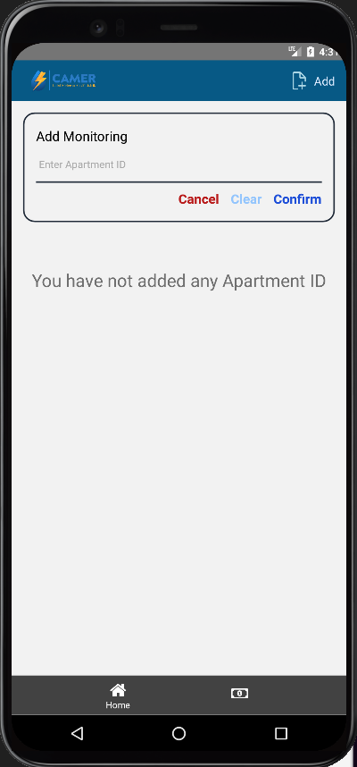
4. Masukkan id yang akan dimonitor, lalu klik `Confirm`.
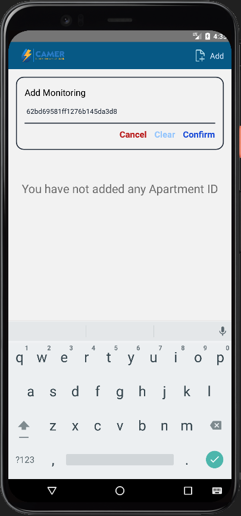
5. Jika id yang dimasukkan benar, akan terdapat card monitoring seperti gambar dibawah ini.
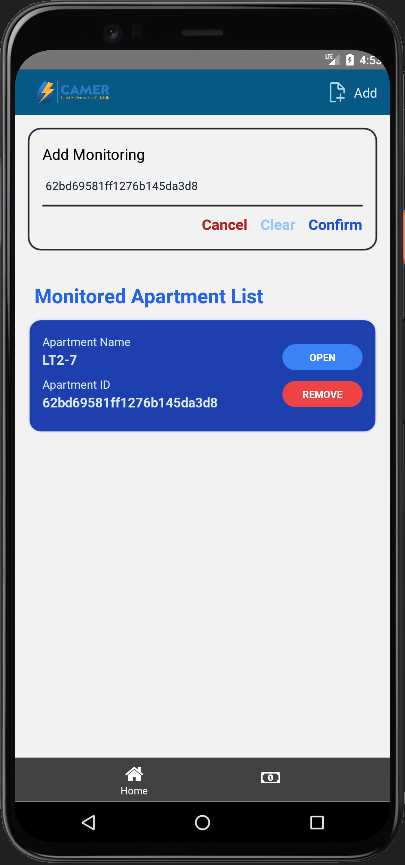
6. Anda dapat menambahkan lebih dari 1 id apartemen.
7. Tekan tombol `Open`, lalu anda akan diarahkan menuju halaman monitoring.
8. Halaman dibawah ini memonitoring secara realtime pada hari yang sama.
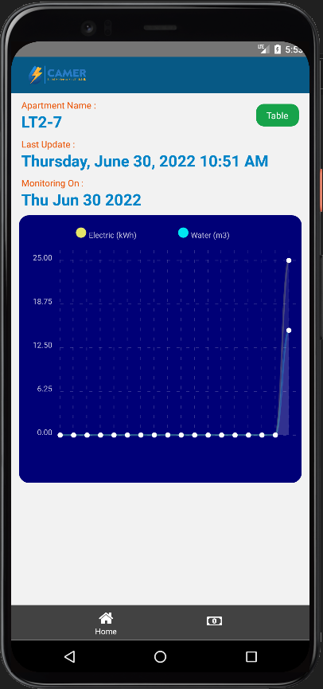
9. Klik tombol `Table` untuk melihat detail dari riwayat monitoring dari hari ke hari, tampilan seperti gambar dibawah ini.
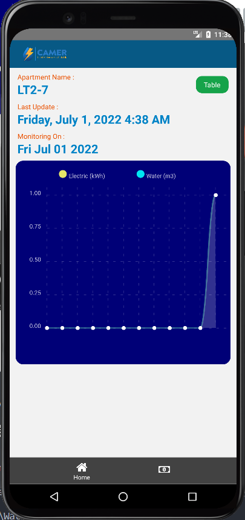
Tiap detik titik pada garis horizontal merepresentasikan jam, pada gambar diatas, titik ke 12 berada pada sumbu Y dengan nilai 1, yang artinya pada jam 11.00 - 12.00 meter air dan listrik terbaca 1 satuan.
10. Perhitungan tab `Bill` dengan logo uang dibawah. Tampilan awal akan seperti gambar dibawah ini.
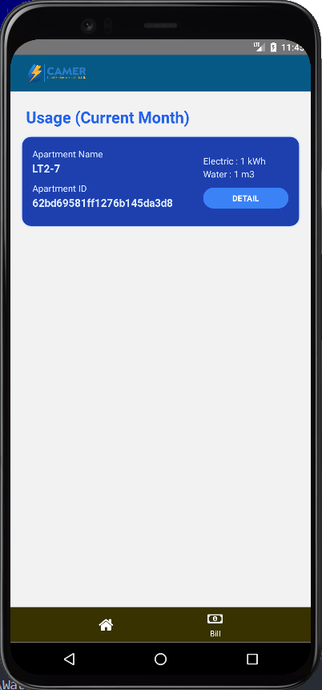
Nilai yang termonitor pada card yakni nilai per bulan.
11. Anda dapat melihat detail bayar anda dengan menekan tombol `Detail`.
12. Lalu anda akan dialihkan menuju laman monitoring tagihan. Masukkan harga per satuan dari masing-masing perhitungan, harga akan di informasikan oleh pihak pengelola apartemen.
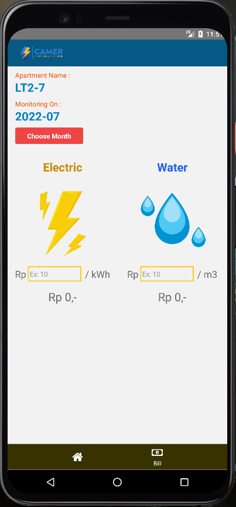
13. Misal harga per kWh adalah Rp 40,- dan harga per m3 adalah Rp 30,-. Nilai tersebut akan dikalikan dengan kumulatif nilai monitoring perbulan dari bulan yang dipilih.
14. Monitoring harga akan terupdate secara real-time

### Apartment Developer Perspective

Dengan asumsi apartemen belum ada yang didaftarkan sama sekali, maka data belum ada sama sekali, dan pihak pengelola apartemen harusnya mendaftarkan tiap apartemen.

Backend APIs Documentation: [https://documenter.getpostman.com/view/12579961/UzBvGiN5](https://documenter.getpostman.com/view/12579961/UzBvGiN5)

#### Mendaftarkan Apartement

1. Buka documenter backend pada aplikasi client pada postman (dapat menggunakan app client lain [menyesuaikan]).
2. Pada Backend APIs Documentation diatas, buka request `Register Meter`, lalu pada parameter `name` terdapat nama yang dapat anda tentukan untuk nama ruangan atau apartemen yang akan anda daftarkan. Sebagai contoh, disini dituliskan LT3-7.
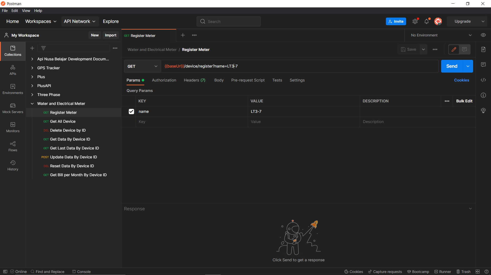
3. Klik Send
4. Jika berhasil, maka akan terdapat response seperti gambar dibawah ini
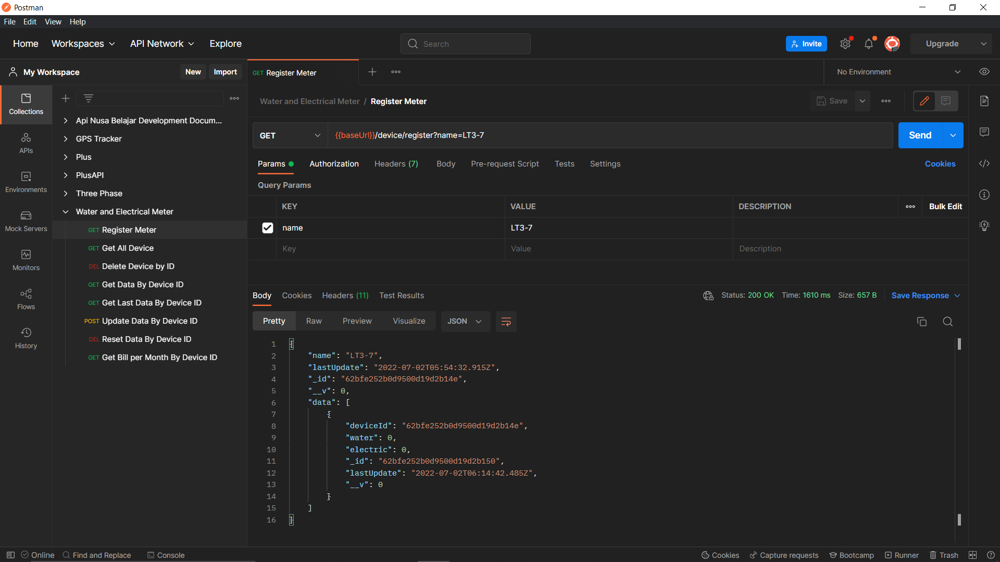
5. Nilai `_id` merupakan id yang akan pengelola berikan kepada penghuni apartmen untuk memonitor apartemenya sendiri.

#### Melihat Apartemen yang sudah di daftarkan

1. Buka request `Get All Device`
2. Klik Send
3. Jika berhasil, maka hasil response akan seperti gambar dibawah ini
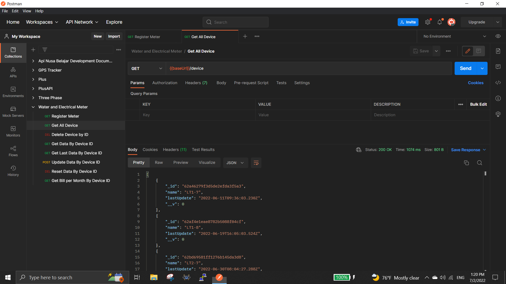
4. Nilai `_id` merupakan id yang akan pengelola berikan kepada penghuni apartmen untuk memonitor apartemenya sendiri.

#### Mengirim data monitoring ke server per apartemen

1. Buka request `Update Data By Device ID`
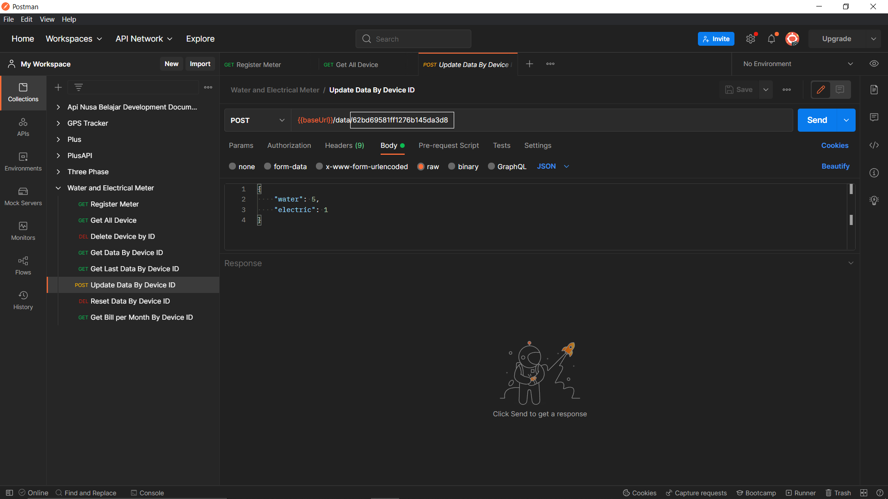
2. Pada gambar diatas, terdapat id device, dapat diubah sesuai id apartemen yang akan di update.
3. Klik Send
4. Jika berhasil, maka hasil response akan seperti gambar dibawah ini
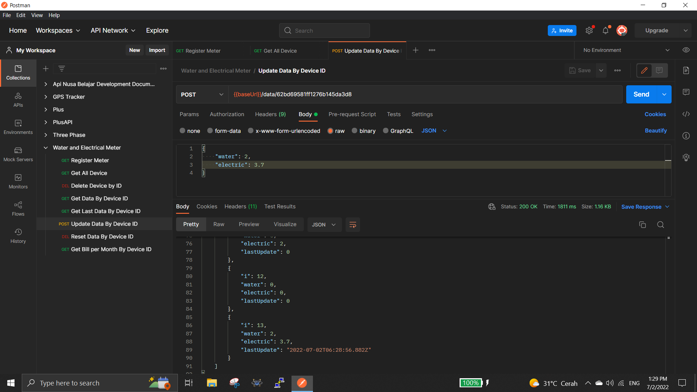

> Note: Jika menggunakan real hardware dan pengembangannya mengguanakan Arduino Framework, maka kode dapat dilihat seperti [kode](__MD__/main.cpp) ini
> Note : API lain tidak perlu dijalankan, hanya untuk mempermudah pengembangan.
